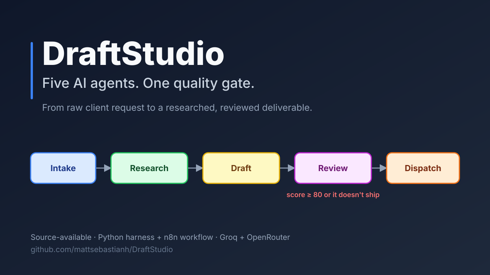
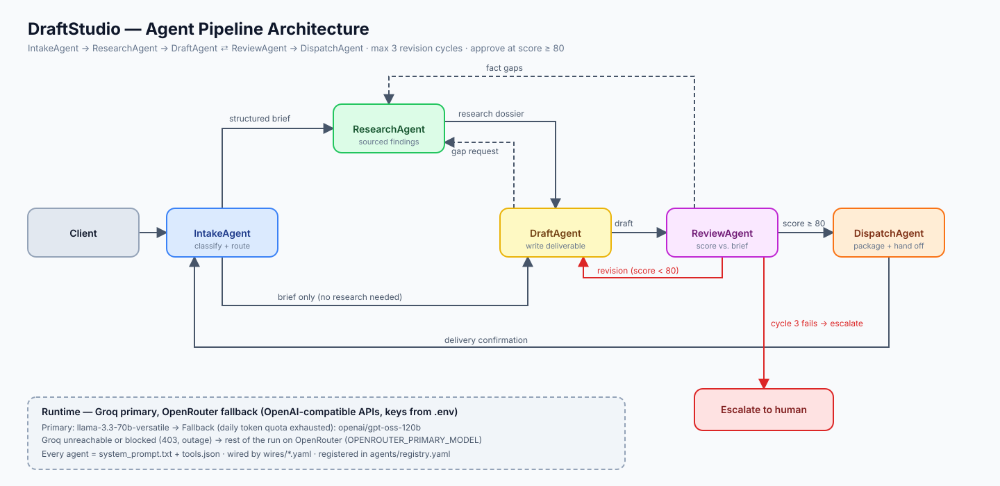
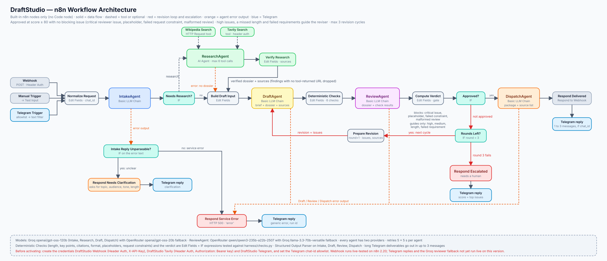
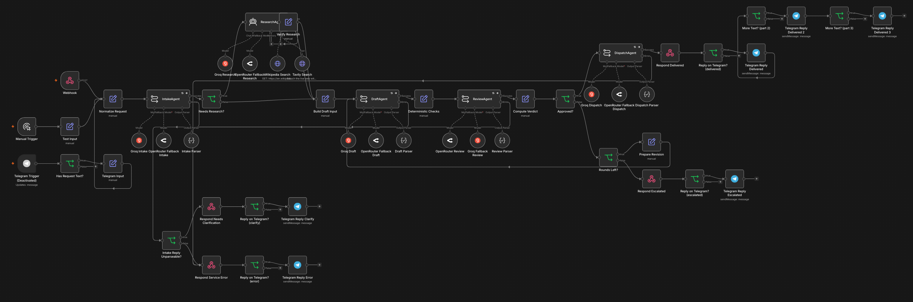

# DraftStudio



[](harness/run_pipeline.py)
[](n8n/draftstudio_pipeline.workflow.json)
[](https://groq.com)
[](https://openrouter.ai)
[](#the-n8n-workflow)
[](https://claude.com/claude-code)

[](LICENSE)

**An autonomous content studio run by AI agents.**

DraftStudio is a five-agent digital worker ecosystem that takes raw client requests and turns them into researched, quality-gated written deliverables. Each agent holds a specific, non-overlapping role — like a staffed editorial studio that runs itself.

All agents are built with [claude-code](https://claude.com/claude-code) and powered by open-weight models served on [Groq](https://groq.com)'s fast inference platform.

## The Agent Lineup

| Agent | Role |
|-------|------|
| **IntakeAgent** | Parses raw client requests into structured briefs, classifies the work, routes it. Entry point for everything. |
| **ResearchAgent** | Investigates topics and returns structured, sourced research dossiers. |
| **DraftAgent** | Creates written deliverables from briefs + research. Can request mid-draft research. |
| **ReviewAgent** | Quality gate before delivery — scores drafts, requests revisions, approves at ≥ 80/100. |
| **DispatchAgent** | Packages approved content, attaches context, delivers to the client. |

## How Work Flows



Research is optional: IntakeAgent routes straight to DraftAgent when the brief needs none, and DraftAgent or ReviewAgent can request more mid-flow (dashed). Red lines are the revision loop (score < 80, max 3 cycles) and human escalation. The n8n version of the same pipeline, with its Telegram entry and reply, error branches, research verification, deterministic checks and the gate:



The agents communicate over 9 verified **wires** — explicit contracts in `wires/` that define the trigger event, message schema, and failure handling for every hop. Key guarantees:

- **Quality gate:** nothing ships below a review score of 80/100
- **Bounded revisions:** max 3 revision cycles, then human escalation
- **Every agent has an escalation path** — ambiguity, low confidence, or failure always routes to a human, never silently drops

## Getting Started

### Prerequisites

- Python 3.10 or newer
- [claude-code](https://claude.com/claude-code) CLI
- A [Groq API key](https://console.groq.com/keys) (free tier works)
- Recommended: an [OpenRouter API key](https://openrouter.ai/keys) as a second provider. Groq can be unreachable from some regions or VPN exit IPs, and the pipeline then fails over to OpenRouter

### Setup

```bash
git clone https://github.com/mattsebastianh/DraftStudio.git
cd DraftStudio
cp .env.example .env
# edit .env and paste in your real GROQ_API_KEY
python3 -m venv .venv
.venv/bin/pip install -r requirements-dev.txt
```

`.env` is gitignored — real keys never leave your machine. The models are configured there too:

| Variable | Default | Purpose |
|----------|---------|---------|
| `GROQ_PRIMARY_MODEL` | `openai/gpt-oss-120b` | Default model for all agent calls |
| `GROQ_FALLBACK_MODEL` | `qwen/qwen3.8-27b` | Used automatically when the primary model's daily token quota (TPD) is exhausted |
| `OPENROUTER_API_KEY` | (none) | Enables the second provider; without it a Groq outage stops the harness |
| `OPENROUTER_PRIMARY_MODEL` | none; e.g. `openai/gpt-oss-120b` (required for the fallback) | Model the harness uses on OpenRouter after Groq fails |
| `TAVILY_API_KEY` | (none) | [Tavily](https://app.tavily.com) key for ResearchAgent's web search; without it research fails soft (no findings, gaps say why) |
| `N8N_WEBHOOK_API_KEY` | (none) | `X-API-Key` secret for the n8n webhook (n8n holds its own copy) |

Swap models by editing `.env` — nothing else references model IDs. Per-agent token budgets and reasoning effort live in `harness/config.py`; they leave headroom because reasoning models (the gpt-oss family) spend completion tokens on reasoning.

### Verify your connection

```bash
set -a && source .env && set +a
curl -s "$GROQ_BASE_URL/models" -H "Authorization: Bearer $GROQ_API_KEY"
```

You should get a JSON list of available models.

## Using the Studio

Open claude-code in the repo root. The studio is operated through five slash commands (project skills in `.claude/skills/`):

| Command | What it does |
|---------|--------------|
| `/spec-agent` | Convert a business brief into a structured agent spec (always run this first) |
| `/new-agent` | Scaffold a complete agent from an existing spec |
| `/agent-wire` | Define a communication contract between two agents |
| `/agent-review` | Audit an agent for safety, completeness, and agentic risks |
| `/context-dump` | Export the session as a structured handoff doc |

**The workflow is spec-first:** `/spec-agent` → `/new-agent` → `/agent-wire` → `/agent-review`. Never scaffold without a spec, and address all Critical/High review findings before activating an agent.

### Running the live pipeline

`harness/run_pipeline.py` executes the full agent pipeline against the Groq API with real model calls:

```bash
.venv/bin/python harness/run_pipeline.py "<raw client request>"
```

It routes the request through IntakeAgent → (ResearchAgent) → DraftAgent → ReviewAgent → DispatchAgent, including the revision loop (max 3 cycles) and human escalation. Along the way:

- every hop message is validated against its wire contract in `wires/`, and every reply against the agent's `agents/<Agent>/output_schema.json` (schema-enforced output where the model supports it, JSON mode plus validation otherwise; invalid replies are retried with the errors fed back)
- ResearchAgent searches the web (Tavily) and fetches pages; a finding survives only if it cites a URL the tools actually returned, and without a search key research fails soft
- ReviewAgent's rubric is combined with deterministic checks (length, key points, placeholder text, citations, format), and the approval decision is computed in code: score ≥ 80 and no critical issue

Each run writes:

- a full I/O log to `tests/live_runs/run_<timestamp>.json` (per-step provider, model, tokens, timing, validation retries and check results), also when a step fails
- the approved deliverable to `deliverables/<slug>.md` (never overwriting an existing file)

The harness retries transient errors (TPM 429s, 5xx), falls back to `GROQ_FALLBACK_MODEL` automatically if the primary model's daily token quota runs out, and switches to OpenRouter (`OPENROUTER_PRIMARY_MODEL`) for the rest of the run if Groq is unreachable or refuses the request (for example a regional block). Set `OPENROUTER_API_KEY` in `.env` to enable that second provider. In claude-code, any request for a new draft, revision, or review is routed through this harness automatically by the project's claude-code instructions — no manual invocation needed.

### The n8n workflow

The same pipeline also exists as an importable n8n workflow, `n8n/draftstudio_pipeline.workflow.json`, triggered by a webhook, a manual test input or a Telegram bot, with the harness's blocking rule (a score of at least 80 and no `critical` issue) plus extra deterministic checks: placeholder text and explicit request constraints (a closing sentence, an exact word count, a minimum number of bullets) block approval, while length, key points, citations and markdown format guide the reviser without blocking. Research findings are kept only if they cite a page the search tools returned. The webhook requires a Header Auth key, and every agent has two LLM providers (Groq and OpenRouter, each the other's fallback). Check the file with `python3 scripts/validate_n8n_workflow.py n8n/draftstudio_pipeline.workflow.json`.

What to set up in n8n after importing it (credentials are referenced by name only, with the placeholder id `REPLACE_ME`, so each node asks you to pick yours):

| Credential | Type | Used by |
|---|---|---|
| `DraftStudio Webhook` | Header Auth (`X-API-Key`, a long random value) | the Webhook node |
| `DraftStudio Tavily` | Header Auth (`Authorization: Bearer <Tavily key>`) | Tavily Search; without a key, disable that node and research still has Wikipedia Search |
| Groq, OpenRouter, Telegram (optional) | their own types | the model nodes and the Telegram nodes |

n8n does not read `.env`: the keys above go into n8n's credential store, and the Telegram chat-id allowlist is set on the trigger node. Research uses two tools: Wikipedia Search (an HTTP Request tool with a descriptive User-Agent, because Wikipedia answers the built-in tool with HTTP 429) and Tavily Search. The workflow's prompts are copies of `agents/*/system_prompt.txt` and its checks are ports of `harness/checks.py`; unit tests fail when either drifts (see `n8n/verify_notes.md` for node verification and live-run findings).

The workflow as it looked on the n8n canvas after import (an earlier version: it predates the research verification step and the Wikipedia Search tool, see the diagram above for the current one):



## Repository Layout

```
agents/          ← One subdirectory per agent (agent.md, system_prompt.txt, tools.json)
  registry.yaml  ← Central registry: status, paths, and wires for every agent
wires/           ← Inter-agent communication contracts (YAML)
specs/           ← Agent specs, written before scaffolding
harness/         ← Live execution harness (run_pipeline.py and its modules)
n8n/             ← Importable n8n workflow (JSON) and node verification notes
scripts/         ← Tooling, e.g. the n8n workflow validator
tests/           ← Unit tests and pipeline test results
assets/          ← Images used by this README (header, architecture diagrams, n8n canvas)

Local only (gitignored, kept as empty folders):
docs/            ← Handbook, n8n design doc, plans
reviews/         ← Audit reports from /agent-review
handoffs/        ← Session export dumps from /context-dump
tests/live_runs/ ← Run logs written by the harness
deliverables/    ← Approved deliverables written by the harness
```

Every agent defines: Role, Goal, Backstory, Tools, Constraints, and Escalation rules. Tool definitions and output schemas are JSON; system prompts are plain text and kept under 500 tokens.

## Status

All 5 agents are built, reviewed, pipeline-tested, and **active**. The full wire map (9 wires) passed static integration testing — see `tests/pipeline_test_results.md`.

**Live execution is verified.** Live end-to-end runs against the Groq and OpenRouter APIs have completed with real client-style requests (scores 72–94/100). The automatic primary→fallback model switch on daily-quota exhaustion is tested and working. After the 2026-10 harness modernization (schema-validated hops, real web research, code-computed review verdict), the ReviewAgent → DraftAgent revision loop and the 3-cycle human escalation have both fired live: most requests were approved after one revision, and a strict-citation brief exhausted its three cycles and escalated with no deliverable (run logs are kept locally in `tests/live_runs/`).

**n8n workflow:** run live on a local n8n 2.20.11, first in the original version (Telegram in and out, the revision loop, a Groq 429 with model fallback, webhook authentication) and then, as a separate copy, in its modernized form (prompts and schemas following `agents/*`, the harness checks as expressions, the research verification, a Wikipedia Search HTTP tool and Tavily): approved first drafts, revision rounds and escalations were all observed. Not yet run live on the modernized copy: the Telegram replies and the Groq reviewer fallback (Groq answered 403 during the tests, so every agent ran on its OpenRouter fallback). Node verification notes and the live-run findings are in `n8n/verify_notes.md`.

**Provider fallback:** the harness switches to OpenRouter when Groq fails (checked live by forcing an invalid Groq key) and the n8n workflow gives every agent two providers. The unit tests (`.venv/bin/pytest`) cover the wiring, the wire contracts, the harness fallbacks and the review checks. The n8n expression tests run the workflow's own expressions in Node.js, so they need `node` installed (they fail without it; set `DRAFTSTUDIO_SKIP_NODE_TESTS=1` to skip them on purpose).

Planned work: priority handling at intake, `client_id` propagation, multi-channel delivery, structured word-count limits from IntakeAgent, and a second web-search provider behind the same tool interface.

## Design Principles

- **Spec-first** — no agent exists without a written, reviewed specification
- **Small, focused agents** — each does substantive, distinct work; no mega-agents
- **Explicit contracts** — every inter-agent message has a schema and a failure path
- **Humans stay in the loop** — every agent has defined escalation rules
- **Secrets stay in `.env`** — no keys or tokens in any file. Model IDs live in `.env` too, with one exception: n8n does not read `.env`, so the workflow JSON hard-codes its model IDs on the nodes (the `OPENROUTER_*` variables in `.env` are reference values there; see the design doc)

## License

DraftStudio is source-available under the [PolyForm Noncommercial License 1.0.0](LICENSE): free to use, modify and share for non-commercial purposes. Commercial use needs written permission from the author.

Security issues: see [SECURITY.md](SECURITY.md).
